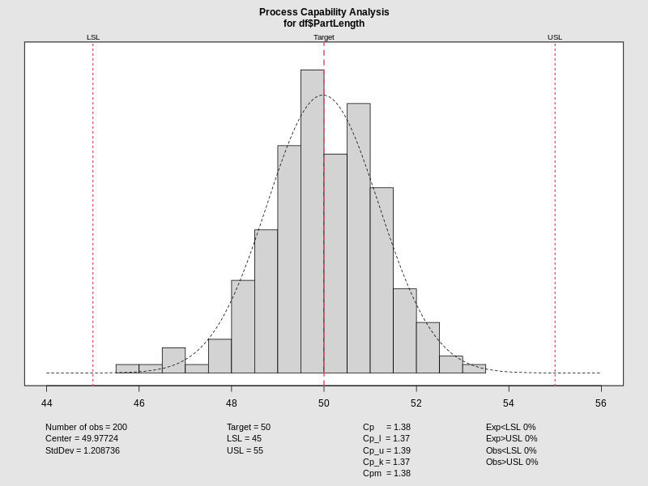
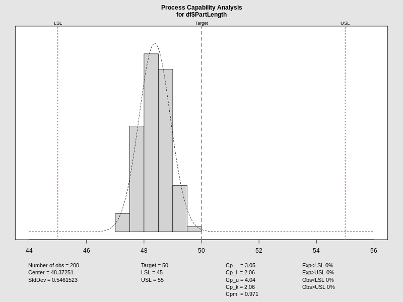
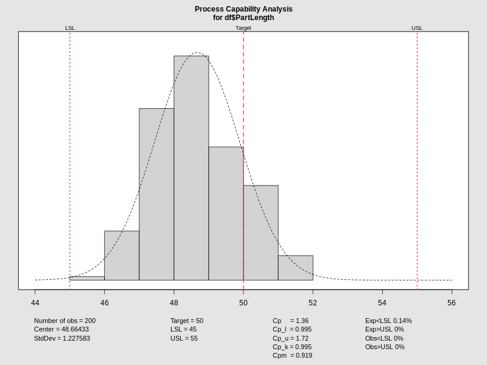

# Machine 1 Analysis

:::: {.columns}
::: {.column width="50%"}
### Machine 1 Performance
**Condition:** 200kPa / 338K

- The process is stable and under control.
- **Capability Metrics:**
  - $C_p$: 1.38
  - $C_{pk}$: 1.37
- The machine is capable and well-centered.
:::

::: {.column width="50%"}
<iframe data-src="media/plots/m1_cc.html" width="100%" height="400px" style="border:none;"></iframe>

:::
::::

---

# Machine 2 Analysis

:::: {.columns}
::: {.column width="50%"}
### Machine 2 Performance
**Condition:** 200kPa / 338K

- **Capability Metrics:**
  - $C_p$: 3.05
  - $C_{pk}$: 2.06
- Machine 2 shows excellent precision but a noticeable mean shift.
:::

::: {.column width="50%"}
<iframe data-src="media/plots/m2_cc.html" width="100%" height="400px" style="border:none;"></iframe>

:::
::::

---

# Machine 3 Analysis

:::: {.columns}
::: {.column width="50%"}
### Machine 3 Performance
**Condition:** 200kPa / 338K

- **Capability Metrics:**
  - $C_p$: 1.36
  - $C_{pk}$: 1.00
- Machine 3 is at the threshold of capability and requires centering adjustments.
:::

::: {.column width="50%"}
<iframe data-src="media/plots/m3_cc.html" width="100%" height="400px" style="border:none;"></iframe>

:::
::::
